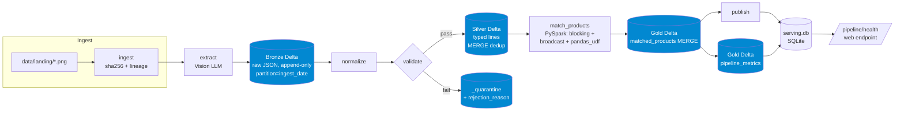
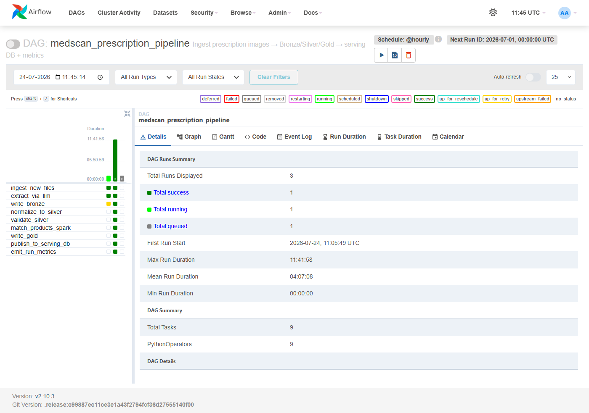

# MedScan Data Pipeline — Medallion / Spark / Airflow

A batch data-engineering layer retrofitted onto the live MedScan app. The web app
is untouched and still serves prescriptions in real time; this pipeline processes
prescription images **in bulk** through Bronze → Silver → Gold Delta Lake layers,
orchestrated by Airflow, with the fuzzy match implemented in PySpark.

## Architecture



Orchestrated by the Airflow DAG `medscan_prescription_pipeline` (hourly, `catchup=True`):

```
ingest_new_files → extract_via_llm (retries=3, exp backoff) → write_bronze →
normalize_to_silver → validate_silver → match_products_spark → write_gold →
publish_to_serving_db → emit_run_metrics
```



## The three layers

| Layer | Path | Contents | Write mode |
|---|---|---|---|
| **Bronze** | `data/bronze/prescriptions/` | Raw Vision-LLM output, verbatim | **Append-only**, partitioned by `ingest_date`. Never mutated. |
| **Silver** | `data/silver/prescription_lines/` | Parsed, typed, validated lines | **Delta MERGE** on `(source_file_hash, line_id)` → idempotent |
| — quarantine | `data/silver/_quarantine/` | Rows that failed validation | Append, with `rejection_reason` |
| **Gold** | `data/gold/matched_products/` | Lines joined to catalogue + generics | **Delta MERGE** on `line_id` |
| — metrics | `data/gold/pipeline_metrics/` | One row per run (monitoring) | Append history |

## Run it locally

Everything runs in Docker (the host needs no Java/Spark).

```bash
# one full pipeline pass in the standalone pipeline image
docker build -f docker/pipeline.Dockerfile -t medscan-pipeline .
docker run --rm -e GEMINI_API_KEY=<key> -e MEDSCAN_BACKEND=gemini \
  -v "$PWD/data:/opt/medscan/data" medscan-pipeline

# or the orchestrated version with Airflow (UI at http://localhost:8080, admin/admin)
cd airflow && GEMINI_API_KEY=<key> docker compose up -d
#   → unpause + trigger "medscan_prescription_pipeline" in the UI
```

Monitoring is exposed on the live web app at **`/pipeline/health`** (reads
`serving.db` with stdlib sqlite — the web process never imports Spark).

## Benchmark — pandas/RapidFuzz vs PySpark (local mode, single box)

Matching N prescription lines (real drug names sampled from the catalogue, with
typos) against the 246K-row catalogue:

| Volume | pandas / RapidFuzz | PySpark | Winner |
|---:|---:|---:|:--|
| 500 lines | **0.75 s** | 27.2 s | pandas |
| 5,000 lines | **8.62 s** | 39.9 s | pandas |

**Honest reading:** pandas wins at every volume tested *in local mode*. Spark's
~27 s of fixed JVM + Arrow + task-scheduling overhead dwarfs the actual scoring
work here. But look at the scaling — pandas grew **11.5×** from 500→5,000 while
Spark grew **1.47×**. Spark's cost is almost all fixed overhead; its payoff is
**horizontal scale** (many executors) and **data that exceeds one machine's
memory**, neither of which `local[*]` on one laptop demonstrates. The crossover is
past the volumes a single box handles comfortably. Reproduce with
`docker run --rm -v "$PWD/data:/opt/medscan/data" medscan-pipeline python -m medscan_pipeline.benchmark`.

## Design decisions (and the alternatives rejected)

1. **Bronze is raw and never mutated** — it's the replay source. If normalize or
   match logic changes, Silver and Gold rebuild from Bronze **without re-paying for
   LLM inference**. Storing parsed data as the source of truth would throw that away.

2. **Airflow, not cron/a shell script** — the extract stage calls an external Vision
   LLM that times out, rate-limits (429), and returns malformed JSON. We need
   **per-stage retry with exponential backoff on that stage specifically**, plus
   **backfill** (`catchup=True`) so missed hourly windows each run as their own
   idempotent logical date. That's retry semantics + backfill, not scheduling for
   its own sake — which is exactly what cron can't give.

3. **Spark for batch matching, RapidFuzz for the live API** — different latency and
   volume profiles. The web app answers single lookups in <10 ms in-process;
   spinning up a 27 s Spark session for one lookup would be absurd. Batch scoring of
   many lines against a huge catalogue is where Spark's model fits. Keeping both,
   and knowing which to use, is the point.

4. **Blocking before fuzzy scoring** — a naive match is an N×246K cross join,
   quadratic and unusable. We block on a cheap 3-char key so each line only compares
   against catalogue entries in its block, and broadcast the catalogue for a
   map-side join with no shuffle. Avoiding the cross join is the actual engineering.

5. **Where the crossover falls** — not within single-box volumes (see benchmark).
   Reported honestly rather than pretending distribution is free.

## Notes / honest limitations

- Spark/Airflow run **in Docker** because the host is Python 3.13 with no JVM
  (PySpark needs Java and Python ≤ 3.12). See `docs/AUDIT.md`.
- The 246K catalogue is `data/bulk.json` (in memory), not a SQLite table — the batch
  serving table (`serving.db`) is a **new** store for pipeline output; the live
  medicine lookup still reads `bulk.json` and is completely untouched.
- `catchup=True` from a July-1 start date will backfill many hourly windows; pause
  the DAG after the first green run in a demo, or set a recent `start_date`.
- Verified end-to-end with **real Gemini extractions** and **real Delta writes**;
  idempotency proven (Bronze appends, Silver stays deduped across re-runs).
